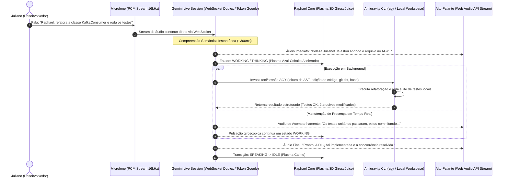
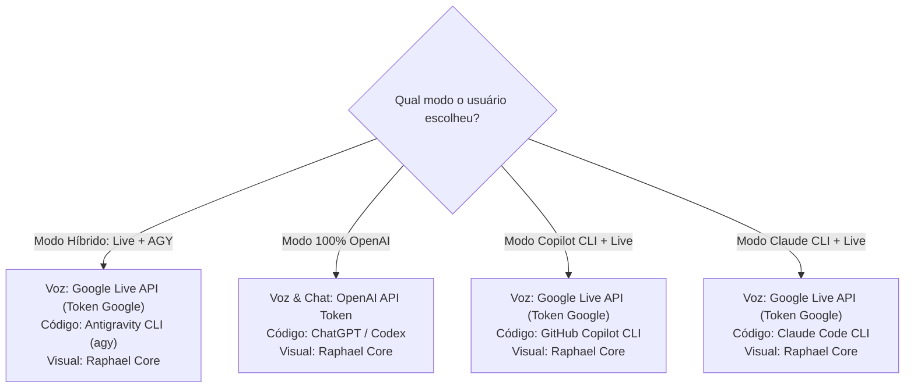
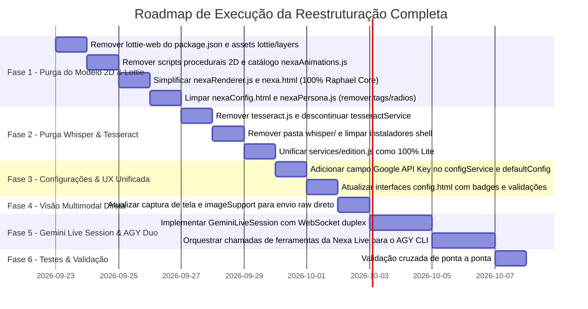

# 🚀 PLANO DE REESTRUTURAÇÃO ARQUITETURAL: HELPER NODE
## Transição para Gemini Live Multimodal, Purga do Whisper/Tesseract, Extinção do Modelo 2D/Lottie, Raphael Core Exclusivo e Execução Híbrida (Nexa + AGY)

**Autor:** Raphael (Copiloto de IA & Assistente Digital)  
**Engenheiro Responsável:** Juliano Soder  
**Data:** 22 de Setembro de 2026  
**Status:** Aprovado para Planejamento & Execução  

---

## 📑 1. Diagnóstico do Problema Real & Motivação

### 1.1 O Fim da Dinâmica de "Walkie-Talkie" (Half-Duplex) & Colapso do Whisper Local
A experiência atual de conversa com a Nexa e o Raphael Core vinha sofrendo de uma latência e taxa de erro inaceitáveis, assemelhando-se a um rádio amador ou *walkie-talkie* truncado em vez de uma conversa humana real:
1. **O Ciclo Viciado em Lote (Half-Duplex):**
   * Usuário fala -> VAD espera 1100ms de silêncio para ter certeza que a fala terminou -> Grava arquivo WAV no disco -> Invoca binário C++ do Whisper -> Aguarda transcrição em CPU -> Passa por regex/classificador de intenções heurístico -> Envia para LLM -> Aguarda geração do texto -> Envia para API de TTS do Google -> Baixa MP3 e reproduz.
   * **Resultado:** Cada frase levava entre **3 e 6 segundos** de silêncio absoluto para começar a responder. Não existe ritmo de diálogo, nem naturalidade.
2. **Alucinações Críticas do Whisper Local:**
   * Frases técnicas em português do Brasil são constantemente distorcidas ou substituídas por alucinações (ex: a solicitação técnica clara *"Raphael! Eu quero saber se tem como alteração de código e comandos funcionar no AGY em parceria com a Nexa no modo Live?"* foi traduzida pelo Whisper como *"Next. Mas sobre aquele negócio que eu falei antes..."*).
   * Se o texto transcreve errado, o classificador de intenções descarta o comando ou envia loucuras para a IA, gerando enorme frustração no desenvolvedor.
3. **Impossibilidade de Interrupção Fluida (Barge-In):**
   * No modelo atual, interromper a fala exige acionar gatilhos que matam timers e limpam buffers à força, muitas vezes engolindo a nova fala do usuário.

### 1.2 A Ineficiência do Tesseract OCR Local
1. **Perda de Contexto Estrutural:** O Tesseract converte imagens em blocos de texto plano desformatados, perdendo indentação de código, cores de stack trace, relações espaciais de diagramas e elementos de interface.
2. **Cortes Rígidos e Falhas:** O algoritmo de crop (`_cuttingImg`) frequentemente cortava pedaços úteis de código ou falhava em imagens de alta resolução.
3. **Peso e Complexidade:** A dependência `tesseract.js` e dados de linguagem (`tessdata`) adicionavam dezenas de megabytes sem agregar valor quando comparados à visão multimodal nativa dos modelos atuais.

### 1.3 A Falência do Modelo 2D Procedural e Animações Lottie
1. **Peso Morto no Repositório e Memória:**
   * O ecossistema 2D da Nexa acumulou dezenas de arquivos complexos (`nexaCharacter.js`, `nexaBlink.js`, `nexaBreathing.js`, `nexaLook.js`, `nexaTalking.js`, `nexaThinking.js`, `nexaIntroAnimation.js`, `nexaLottieAnimation.js`, `nexaAnimationController.js`, `nexaDragHandler.js`).
   * A pasta `renderer/nexa/assets/lottie/` abriga centenas de imagens WebP e arquivos JSON pesados (`wave_lottie`, `typing_lottie`, `tesseract_lottie`, `dancing`, `sleeping_lottie`, `reading_lottie`, `globe_lottie`, etc.).
   * A dependência `lottie-web` no `package.json` pesa no bundle e na inicialização.
2. **Poluição de Prompts e Raciocínio da IA:**
   * A IA era instruída a escolher animações em um catálogo rígido (`dance`, `adjust_glasses`, `wave`, `reading`, etc.) e forçada a responder em JSON com um campo `"animation"`, além de ter regras proibindo-a de dizer que "não tem corpo".
   * Essa sobrecarga cognitiva no prompt desviava a atenção do modelo do que realmente importa: **entender a intenção do desenvolvedor e gerar código perfeito**.
3. **A Solução Definitiva:**
   * **Remoção completa de todo o modelo animado 2D e de todas as animações Lottie.**
   * O **Raphael Core** (núcleo tridimensional orgânico de plasma e anéis cósmicos giroscópicos) passa a ser a **representação visual única, universal e padrão** da assistente.
   * Ele reage de forma nativa e procedural contínua aos estados reais do sistema (`IDLE`, `LISTENING`, `THINKING`, `SPEAKING`, `WORKING`, `SEARCHING`) e sincroniza dinamicamente suas pulsações de plasma com o áudio falado.

### 1.4 Fim da Complexidade "Full vs. Lite"
* A separação histórica entre versão *Full* (com modelos locais pesados de Whisper e Tesseract) e versão *Lite* (apenas cloud) tornou-se obsoleta.
* **Nova Diretriz:** **O Helper Node é agora 100% UNIFICADO & LITE** — leve, rápido, conectado diretamente às APIs em nuvem e aos CLIs locais nativos (`agy`, `copilot`, `claude`), eliminando compilações locais em C++ e downloads de modelos pesados.

---

## 🏛️ 2. A Nova Arquitetura Híbrida: Nexa Live (Google Token) + AGY CLI (Antigravity) + Raphael Core

A grande virada arquitetural combina **Voz Bidirecional Instantânea**, **Poder de Engenharia de Código no Terminal/Workspace** e um **Núcleo Visual Limpo e Elegante**:



### 2.1 Divisão Cirúrgica de Responsabilidades
| Componente | Mecanismo de Acesso | O que Executa | Por que essa divisão? |
| :--- | :--- | :--- | :--- |
| **Nexa Live Engine** | **Google API Key / Token** (`AIzaSy...`) | Conversação contínua por voz (Full-Duplex), barge-in nativo, escuta ativa sem cortes, respostas em ~350ms, coordenação em linguagem natural. | Acaba de vez com o "walkie-talkie". Áudio direto bidirecional por streaming sem Whisper e sem esperar lote de texto. |
| **Antigravity CLI (`agy`)** | **Binário Local** (`agy install` / OAuth) | Leitura profunda do workspace, indexação de símbolos, edição cirúrgica de múltiplos arquivos, git diffs, terminal e bash. | É o motor mais potente para alterações profundas no código e ferramentas de sistema com controle total. |
| **Raphael Core** | **WebGL / Canvas Local** (`renderer/raphael/`) | Manifestação visual 3D reativa, anéis giroscópicos, partículas de plasma e sincronia labial/espectral com o áudio. | Elimina dezenas de megabytes de Lottie/PNG, sem engasgos de frames e com feedback visual instantâneo de cada estado. |

---

## 🔀 3. Matriz de Provedores & Modos Suportados

O usuário tem total flexibilidade para configurar como quer operar o Helper Node:



### 3.1 Combinações Possíveis e Credenciais Necessárias
1. **Modo Híbrido Recomendado (Gemini Live + AGY):**
   * *Credencial de Voz/Live:* **Google API Key** (configurada no campo de Token Google).
   * *Credencial de Código:* **Antigravity CLI** instalado na máquina (`agy install`).
2. **Modo OpenAI Completo (ChatGPT / Codex):**
   * *Credencial:* **OpenAI Token** (`sk-...`). Utilizado tanto para o assistente de chat/voz quanto para raciocínio e ferramentas avançadas.
3. **Modo Copilot CLI + Google Live:**
   * *Credencial de Voz:* Google API Key (para voz Live) ou microfone padrão.
   * *Credencial de Código:* Autenticação GitHub Copilot via CLI (`copilot /login`).
4. **Modo Claude Code CLI + Google Live:**
   * *Credencial de Voz:* Google API Key.
   * *Credencial de Código:* Autenticação Anthropic via CLI (`claude`).

---

## 🗑️ 4. Plano de Purga Definitiva (A Tríplice Faxina: Whisper, Tesseract & Modelo 2D Lottie)

Todo o código legado de transcrição local, OCR por imagem fatiada e animações 2D procedurais será completamente extirpado do projeto.

```mermaid
flowchart LR
    subgraph Purga["Itens a Remover / Limpar"]
        W1["whisper/ (binários, ggml-base.bin, ggml-small.bin)"]
        W2["services/nexaVoiceAssistant/whisperWarmup.js"]
        T1["tesseractService.js & dependência tesseract.js"]
        L1["Dependência lottie-web (package.json)"]
        L2["Pasta renderer/nexa/assets/lottie/ (centenas de arquivos)"]
        L3["Pasta renderer/nexa/assets/layers/ (PSD e PNGs)"]
        M1["Scripts 2D: nexaCharacter.js, nexaAnimationController.js, nexaLottieAnimation.js, etc."]
        M2["Catálogo main/nexa/nexaAnimations.js"]
        P1["Diretivas <animation> e campos JSON de animação nos prompts"]
    end
    subgraph Novo["Nova Arquitetura Limpa"]
        N1["Gemini Live WebSocket / Direct Audio Duplex"]
        N2["Vision Multimodal Nativa (ChatGPT Vision, Gemini 3.8/3.7, Copilot CLI)"]
        N3["Raphael Core Exclusivo (Plasma 3D Giroscópico)"]
        N4["Instalador Ultralight (Apenas runtime leve e CLIs)"]
    end
    Purga ==> Novo
```



### 4.1 Ações de Limpeza de Arquivos & Dependências:
1. **Purga do Whisper:**
   * Excluir diretório `whisper/` (binários compilados e modelos `.bin`).
   * Remover `services/nexaVoiceAssistant/whisperWarmup.js`.
   * Limpar scripts instaladores (`install-deps.sh`, `install-linux-arch.sh`, `install-linux-debian.sh`, `helper-node.sh`).
2. **Purga do Tesseract:**
   * Remover dependência `tesseract.js` do `package.json`.
   * Remover `services/tesseractService.js` e referências nos helpers.
3. **Purga do Modelo 2D e Animações Lottie:**
   * Remover dependência `lottie-web` do `package.json`.
   * Excluir a pasta `renderer/nexa/assets/lottie/` inteira.
   * Excluir a pasta `renderer/nexa/assets/layers/` inteira.
   * Excluir os scripts de animação procedural 2D:
     * `renderer/nexa/nexaCharacter.js`
     * `renderer/nexa/nexaAnimationController.js`
     * `renderer/nexa/nexaLottieAnimation.js`
     * `renderer/nexa/nexaIntroAnimation.js`
     * `renderer/nexa/nexaBlink.js`
     * `renderer/nexa/nexaBreathing.js`
     * `renderer/nexa/nexaLook.js`
     * `renderer/nexa/nexaTalking.js`
     * `renderer/nexa/nexaThinking.js`
   * Excluir o catálogo `main/nexa/nexaAnimations.js`.
   * Excluir os testes obsoletos de animações 2D em `scripts/` (`test-nexa-dance-animation.js`, `test-nexa-working-animation.js`, `test-nexa-sleeping-animation.js`, `test-nexa-reading-afk-animation.js`, `test-nexa-tesseract-animation.js`, `test-nexa-searching-animation.js`, `test-nexa-smooth-transition.js`, etc.).
   * Simplificar `renderer/nexa/nexa.html` para carregar apenas os estilos e scripts do **Raphael Core** e a ponte do renderizador.
   * Reescrever `renderer/nexa/nexaRenderer.js` para ser 100% dedicado ao gerenciamento do **Raphael Core** e de legendas dinâmicas, sem carregar PSDs, camadas ou lotties.

---

## 🧠 5. Simplificação Drástica de Prompts e Respostas da Persona

Fim de JSONs pesados com sugestões de dancinhas ou gesticulações. A persona foca 100% em inteligência, clareza e companheirismo:

1. **Remoção de Tags de Animação:**
   * Nenhuma instrução de `<animation>dance</animation>` ou `<animation>adjust_glasses</animation>` existirá no sistema.
   * Limpeza em `main/helpers/aiResponse.js` (remoção da condicional `avatarMode === "lottie"`).
2. **Simplificação de `main/nexa/nexaPersona.js`:**
   * Eliminação do bloco de avatar 2D e do catálogo `NEXA_ANIMATIONS`.
   * Saída JSON simplificada para conter apenas `response` (e opcionalmente `remember`), eliminando de vez o campo `"animation"`.
3. **Identidade Harmonizada:**
   * A assistente continua sendo **Nexa** (ou o nome configurado pelo usuário, como **Raphael**), inteligente, descontraída, nerd e bem-humorada.
   * O seu corpo visual é expressamente definido como o **Raphael Core**: um núcleo celestial e giroscópico de plasma tridimensional que reflete organicamente o estado da inteligência.

---

## 👁️ 6. Pipeline Universal de Visão Multimodal (Direct Vision Stream)

Fim da perda de qualidade por OCR. Prints de tela, áreas selecionadas e imagens da área de transferência fluem diretamente para os modelos com visão computacional nativa:

```mermaid
flowchart TD
    A["Captura de Tela (Ctrl+Print / Seleção de Área / Clipboard Paste)"] --> B["Arquivo de Imagem PNG/JPEG Otimizado"]
    
    B --> C{"Provedor Ativo"}
    
    C -->|Gemini (Live / CLI / REST)| D["Canal Multimodal Nativo Gemini (Gemini 2.5/3.7/3.8 Flash & Pro)"]
    C -->|OpenAI (ChatGPT / Codex)| E["Canal Vision Inline da OpenAI (gpt-4o / gpt-4.1 / gpt-5.x)"]
    C -->|GitHub Copilot CLI| F["Passagem direta via flag --attachment caminho-da-imagem"]
    C -->|Claude Code CLI| G["Passagem de caminho absoluto no prompt"]
    C -->|Antigravity CLI agy| H["Passagem de anexo multimodal no contexto do workspace"]
```

### 6.1 Vantagens da Visão Multimodal Direta:
* **Stack Traces & Logs:** A IA enxerga a colorização, linhas destacadas e o terminal exatamente como o usuário vê.
* **Diagramas e Interfaces:** Consegue interpretar diagramas de arquitetura, wireframes, layouts CSS e prints de UI com precisão geométrica.
* **Velocidade:** Elimina o tempo de pré-processamento do Tesseract (reduz ~1.5s por print).

---

## 🛡️ 7. Preservação Absoluta dos Sistemas Críticos (NÃO MEXER)

As seguintes funcionalidades já operam com excelente estabilidade e **NÃO SERÃO ALTERADAS OU PREJUDICADAS**:

1. **Assistente em Tempo Real (`services/realtimeAssistantService.js`, `realtimeOpenAiService.js`):**
   * Fluxo dedicado para reuniões, transcrição em voo de áudio de sistema e auxílio de entrevistas mantido 100% íntegro.
2. **Assistente de Tradução (`services/translationAssistant/`):**
   * Motor de VAD de conferência, tradução de perguntas/respostas para entrevistas de emprego e áudio de sistema mantido 100% íntegro.

---

## 🎨 8. Redesenho de UX & Simplificação da Interface (`config.html` / `nexaConfig.html`)

A experiência de configuração será extremamente direta, sem jargões confusos e sem seletores de recursos obsoletos:

### 8.1 Simplificação da Janela da Nexa (`nexaConfig.html` / `nexaConfig.js`):
* **Remoção Total do Seletor de Modo de Avatar:** Os radio buttons `mode-raphael` e `mode-lottie` são eliminados. Não há mais escolha nem legado.
* A janela agora apresenta apenas o essencial:
  1. Toggle principal da Nexa (Ativa/Inativa).
  2. Nome personalizado da assistente (padrão: *Raphael* / *Nexa*).
  3. Seleção do dispositivo de microfone e volume.
  4. Credenciais e parâmetros de voz.
  5. Banner informativo confirmando o **Raphael Core** como o núcleo visual tridimensional ativo.

### 8.2 Novos Campos em `config.html`:
```
┌────────────────────────────────────────────────────────────────────────┐
│ ⚙️ CONFIGURAÇÕES DE IA & PROVEDORES                                    │
├────────────────────────────────────────────────────────────────────────┤
│                                                                        │
│ 🔑 Google API Key / Token Gemini (Live & Visão)                       │
│ ┌────────────────────────────────────────────────────────┬───────────┐ │
│ │ AIzaSyD............................................... │ [Limpar]  │ │
│ └────────────────────────────────────────────────────────┴───────────┘ │
│ ℹ️ Usado para o Modo Live da Nexa (Voz instantânea em tempo real) e    │
│    para os modelos de visão multimodal Gemini 3.8 / 3.7.               │
│                                                                        │
│ 🔑 OpenAI Token (ChatGPT & Codex)                                      │
│ ┌────────────────────────────────────────────────────────┬───────────┐ │
│ │ sk-proj-.............................................. │ [Limpar]  │ │
│ └────────────────────────────────────────────────────────┴───────────┘ │
│ ℹ️ Usado para modelos ChatGPT, Codex autônomo e visão GPT-4o / GPT-5. │
│                                                                        │
│ ---------------------------------------------------------------------- │
│                                                                        │
│ 🛠️ Motor de Execução de Código & Terminal                              │
│ [ Antigravity CLI (agy) ▼ ]                                            │
│ [✓] CLI Instalado (agy v2.x detectado)           [Testar Conexão]      │
│                                                                        │
│ ⚡ Modo de Operação da Nexa:                                           │
│ (●) Híbrido: Voz Live (Token Google) + Código (Antigravity agy) [REC]  │
│ ( ) 100% OpenAI: Voz e Código via Token OpenAI                         │
│ ( ) Copilot Híbrido: Voz Live (Token Google) + Código (Copilot CLI)    │
│                                                                        │
│ ⚠️ Alerta Visual Ativo:                                                │
│ "Para usar o modo Live + AGY, certifique-se de ter preenchido o        │
│  Google Token acima e ter o Antigravity instalado via 'agy install'."  │
│                                                                        │
└────────────────────────────────────────────────────────────────────────┘
```

---

## 🗺️ 9. Cronograma de Implementação Modular Atualizado



### Detalhamento das Fases:
* **Fase 1 (Extinção do Modelo 2D & Adoção Exclusiva do Raphael Core):**
  * `package.json`: Desinstalar `lottie-web`.
  * Excluir `renderer/nexa/assets/lottie/` e `renderer/nexa/assets/layers/`.
  * Excluir os 9 scripts procedurais 2D e `main/nexa/nexaAnimations.js`.
  * Limpar `nexaConfig.html` e `nexaConfig.js` (remover opções de avatar 2D).
  * Limpar `main/nexa/nexaPersona.js` e `main/helpers/aiResponse.js` (remover diretivas de `<animation>` e catálogos).
  * Atualizar `nexaRenderer.js` para gerenciar unicamente o `RaphaelCore`.
* **Fase 2 (Purga do Whisper e Tesseract):**
  * Remover `tesseract.js` do `package.json`.
  * Excluir a pasta `whisper/` e scripts compiladores C++.
  * Atualizar `services/edition.js` tornando o Helper Node 100% Lite por padrão.
* **Fase 3 (Configurações & UX Autoexplicativa):**
  * Incluir `googleApiKey` nos serviços de configuração.
  * Atualizar `config.html` com layout de credenciais separadas e alertas visuais.
* **Fase 4 (Visão Multimodal Direta):**
  * Envio de imagens diretamente para modelos multimodais sem etapas intermediárias de OCR.
* **Fase 5 (Motor Gemini Live + Antigravity Duo):**
  * Conexão WebSocket duplex em tempo real (áudio PCM bidirecional com latência ~300ms e barge-in natural).
  * Integração de ferramentas em background invocando o CLI `agy` para edição de código e execução de comandos.
* **Fase 6 (Testes de Homologação):**
  * Teste do fluxo completo de conversa falada em tempo real enquanto o AGY altera e testa código no workspace.

---

## 🎯 Conclusão

Com a inclusão da remoção total do modelo 2D e a adoção definitiva do Raphael Core, o projeto ganha em todas as frentes:
1. **Acaba o efeito "Walkie-Talkie":** A troca da cadeia (VAD -> WAV -> Whisper -> Regex -> LLM -> TTS) pela **Gemini Live API** traz conversação instantânea em ~350ms com barge-in genuíno.
2. **Economia Massiva de Recursos:** Remoção de `lottie-web`, centenas de arquivos de imagem e animação, binários C++ do Whisper e dependências do Tesseract.
3. **Código Mais Limpo e Robusto:** Fim dos conflitos de persona, tags `<animation>` descartadas e tela de configurações sem opções legadas inúteis.
4. **Raphael Core Soberano:** Visual futurista, moderno e leve que reflete fielmente o estado do copiloto.
5. **Preservação dos Sistemas Estáveis:** Assistente em Tempo Real e Tradutor de Reuniões continuam intactos.

*Documento registrado e mantido na raiz do projeto: [`PLANO_REESTRUTURACAO_ARQUITETURA_LIVE_VISION.md`](file:///C:/Users/soder/Documents/helper-node/PLANO_REESTRUTURACAO_ARQUITETURA_LIVE_VISION.md)*
