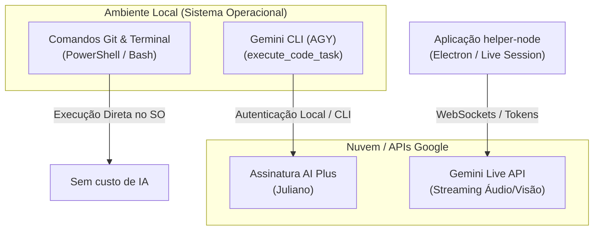

# Relatório de Arquitetura de Execução e Consumo de Recursos

Este documento descreve o fluxo de execução de comandos, tarefas de desenvolvimento e integrações no projeto **helper-node**, detalhando a separação de responsabilidades, o consumo de recursos e a utilização de créditos/cotas de Inteligência Artificial.

---

## 1. Visão Geral da Arquitetura de Execução

O ecossistema de desenvolvimento e operação do projeto é estruturado em três fluxos distintos de processamento:

---

## 2. Detalhamento dos Fluxos

### 2.1 Comandos Git e Terminal (Shell Local)
* **Como funciona:** Comandos de controle de versão (`git status`, `git commit`, `git push`, etc.), scripts de automação (`npm run`, build, testes) e comandos de manipulação do sistema operacional são executados diretamente no shell local do host (PowerShell no Windows ou Bash no Linux).
* **Consumo de IA:** **Zero**.
* **Impacto:** Não consome créditos, cotas ou chamadas a modelos de IA. A execução é 100% computada pela máquina local.

### 2.2 Tarefas de Código via `execute_code_task` (Gemini CLI / AGY)
* **Como funciona:** Tarefas complexas de codificação, refatoração, análise de código e automação de desenvolvimento disparadas através da ferramenta `execute_code_task` utilizam a infraestrutura do **Gemini CLI (Antigravity - AGY)** instalado localmente.
* **Consumo de IA:** Consome créditos da **assinatura AI Plus do Juliano**.
* **Impacto:** A autenticação e o faturamento dessas tarefas estão vinculados diretamente ao plano contratado do usuário (Google One AI Premium / Gemini Advanced), garantindo modelos de alta capacidade para edição e geração de código sem cobrança por requisição avulsa da API pública.

### 2.3 Gemini Live API (Interação em Tempo Real)
* **Como funciona:** A funcionalidade de assistente interativo em tempo real do **helper-node** (streaming de voz/áudio bidirecional e captura multimodal/visão) conecta-se diretamente aos servidores do Google via WebSockets.
* **Consumo de IA:** **Cota de Tokens dedicada da Gemini Live API**.
* **Impacto:** Possui cota própria e independente (RPM - *Requests per Minute*, TPM - *Tokens per Minute* e limites de faturamento de tokens por sessão de streaming). Não interfere no saldo ou cota do Gemini CLI/AI Plus e vice-versa.

---

## 3. Matriz Comparativa de Consumo

| Componente / Ação | Interface / Ferramenta | Ambiente de Execução | Modelo de Custo / Consumo de IA |
| :--- | :--- | :--- | :--- |
| **Comandos de Terminal e Git** | Shell Local (`pwsh` / `bash` / `git`) | Local | **Sem custo de IA** (Processamento local da máquina) |
| **Tarefas de Código (`execute_code_task`)** | Gemini CLI (AGY) | CLI Local / Cloud Google | **Assinatura AI Plus (Juliano)** |
| **Assistente Live / Voz e Visão** | Gemini Live API (WebSockets) | Nuvem (Google AI) | **Cota de Tokens da Gemini Live API** (Tokens de áudio/texto/imagem) |

---

## 4. Recomendações de Uso

1. **Operações de Sistema e Repositório:** Podem ser executadas livremente via terminal/Git sem preocupação com limite de chamadas de IA.
2. **Desenvolvimento e Refatoração:** Utilize o agente e tarefas de código para automações pesadas no código, aproveitando os limites da assinatura AI Plus.
3. **Sessões Live:** Gerencie a duração e o envio de frames de captura de tela/áudio para otimizar o uso da cota de tokens por minuto da Gemini Live API.
